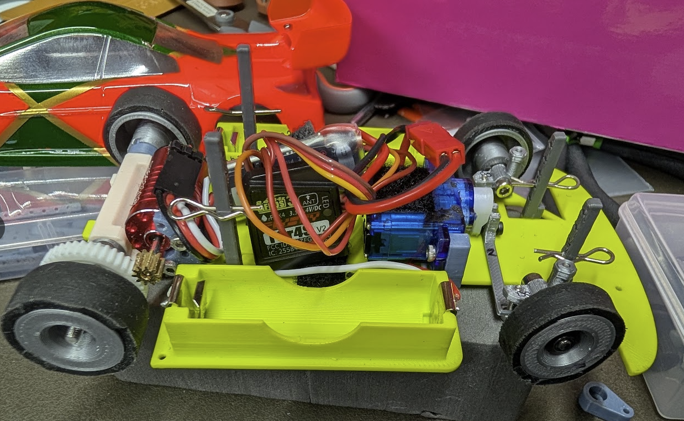
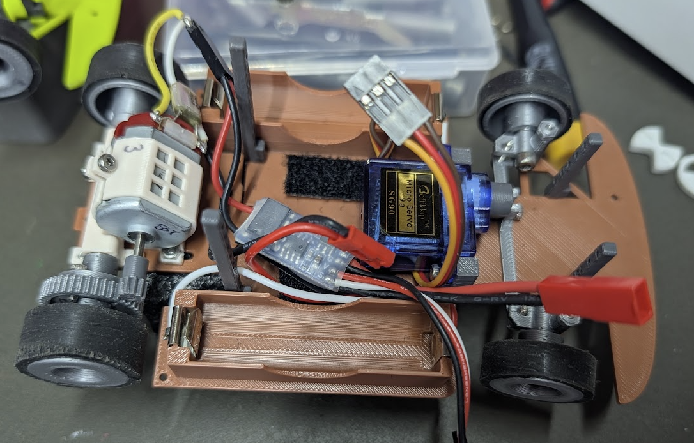
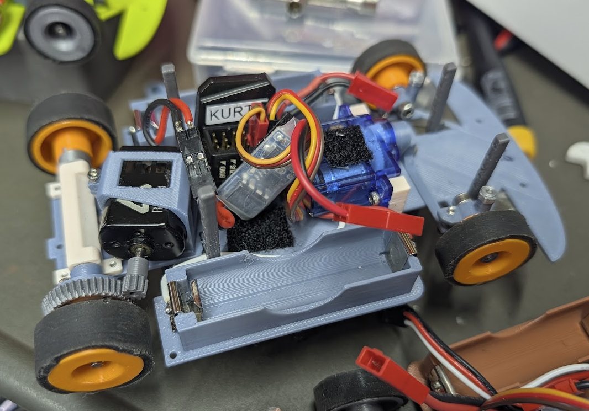
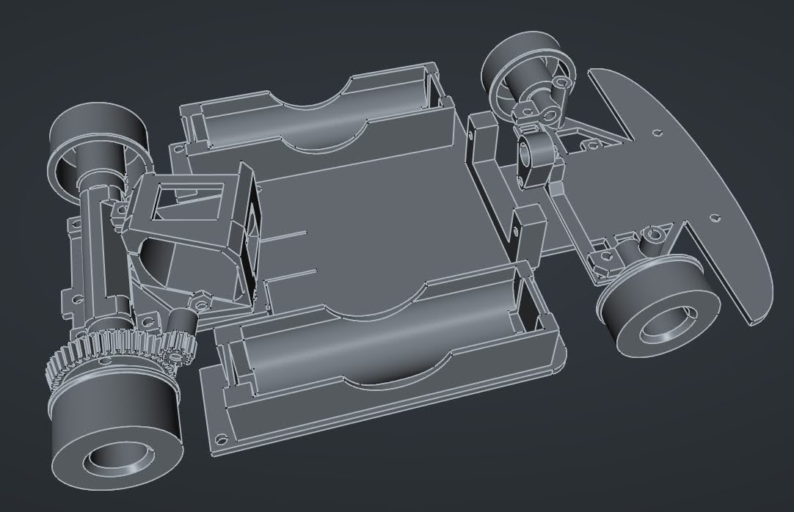

# 1:28 Scale 3D Printable RC Car #
This is a collection of 3D files built in [FreeCAD](https://www.freecad.org/). 
It began as a project with a goal of making the least expensive viable RC car that
would still be suitable for competitions for STEM programs in schools. 

See the [History](doc/history.md) page for more info.

## Current State ##
As of Summer 2026, the Mid-Tier cars we've built and assembled are competitive with
box-stock cars of the main manufacturers. 

## Downloading ##
See the releases tab for the latest releases. These packages contain the most common
files and variants that should be more than enough to get you started with a functional
car.

## Materials Needed ##
You will need several [materials](doc/materials.md) and tools. This documentation
will try to walk through the recommended options to get started with the basics.

## Printing and Assembly ##
See [Getting Started](doc/gettingstarted.md).
See [Printing](doc/printing.md) and [Assembly](doc/assembly.md).

## Building from Source ##
You will need [FreeCAD 1.1](https://www.freecad.org/) or higher.
- With Gear Workbench installed (required)
- With Fasteners Workbench installed (required)
- With History Workbench installed (recommended)

You will need [Python 3.14](https://www.python.org/downloads/) or higher to run some of
the tools, like the automated exporter. See [Exporiting](doc/export.md).

## Advanced Topics ##
For the truly adventurous, you can make your own [tires](doc/tires/diytires.md).

## Contributing ##
See [Contributing](doc/contributing.md) for more info.

## Index ##
- [Getting Started](doc/gettingstarted.md)
- [Printing](doc/printing.md)
- [Materials](doc/materials.md)
- [Assembly](doc/assembly.md)
- [Electronics](doc/electronics.md)
- [Batteries](doc/batteries.md)
- [Trasmitters and Receivers](doc/receivers.md)
- [Tires](doc/tires/tires.md)
- [DIY Tires](doc/tires/diytires.md)
- [Exporting](doc/export.md)
- [History](doc/history.md)
- [Contributing](doc/contributing.md)
- [Licenses](LICENSE.md)
