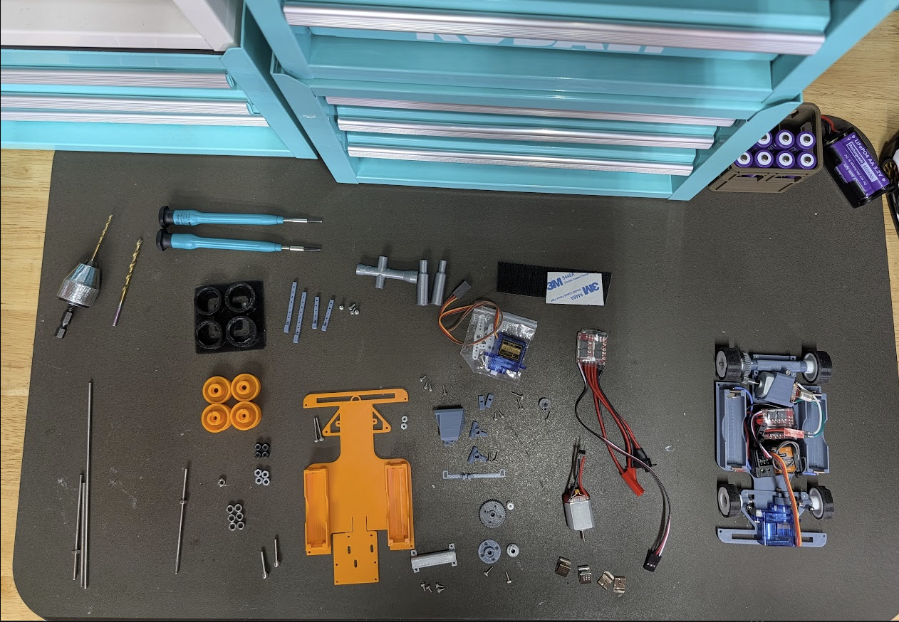

# Assembly #

## Basic Assembly ##

### Step 1 ###
- M2x16 (2x) front screws through the floor pan for steering knuckles
- 2mm drill bit to clean our vertical tube section of steering knuckles
- M3x16 (2x) front axle screws through steering knuckles
- Steering knuckles placed over M2x16 screws
- M2 (2x) nuts on top of M2x16 screws to hold down steering knuckles
- M2x6 or M2x8 (2x) to hold Steering Link to each side steering knuckle

### Step 2 ###
- M2x6 or M2x8 (2x) to attach Steering servo to servo mount
- Decide whether you're going to use the provided steering servo arm and trim to size (recommended), or use the printed servo arms
- M2x6 (1x) into steering servo arm to line up with Steering Link, trim arm with side-cutters if necessary
- It is a good idea to power up the servo to get it to a neutral position before mounting the steering servo arm
- Servo-provided screw to mount servo arm
- M2x4 (2x) up through main plate to attach Servo Mount to chassis

### Step 3 ###
If you are using the AA battery sizes, cut 3 sections of about 8cm of wire.
Strip the ends of the wire about 1.5mm. Solder one wire to a negative terminal.
Solder one wire to a positive terminal. The third wire will connect the second 
positive terminal to the second negative terminal, creating a series battery configuration.

On the remaining positive and negativee ends, these should get a connector, or
be soldered directly to the input of the ESC. See [Electronics](electronics.md).

### Step 4 ###
- M2x4 (4x) up through chassis to Threaded Rear Axle Mount, with the wedge shape
facing forward.
- MR63ZZ (2x) bearings pressed into each side of the Axle Mount

Now we need to super-glue an M3 nut onto one side of the 75mm Threaded M3 Rod that
we are going to use as our axle. Set the axle through the Rear Axle Mount, and try
to center it by eye with the chassis. Take a metal M3 nut, and thread it onto the 
right side (gear side) of the axle until it is just touching the bearing. You will 
have to keep re-centering and adjusting, as the axle is certainly going to move 
while doing this.

Once you are satisfied with the centering and where the axle sits relative to the chassis,
remove the axle.

Set the axle on something in such a way that the M3 nut is not touching anything, and then
apply a small dab of super glue to each side of the nut. Allow it to dry for 5 minutes.

This nut becomes our solid drive point through the axle. It is certainly possible to break
the nut loose with time or with high powered motors, so you may have to repair this 
in the future.

### Step 5 ###
- Place the glued rear axle into the Rear Axle Mount with the M3 nut to the right
of the chassis (gear side)
- Thread another M3 nut (1x) on the left side of the axle, but not all the way to the bearing
- Optional, ream the Axle Spacer with a 3mm drill bit
- Place the Rear Axle Spacer on the left side and line up the hex cutout with the M3 nut,
once in place the nut should be almost completely covered by the space
- Gently tighten the Spacer+Nut until they are almost touching the left side bearing, there should
be about 0.25mm of play in order to allow the Axle to spin freely on the bearings. We can adjust
this later.
- M2x6 (at least 2x) screws are used to hold the 42 Main Gear to the Threaded Solid Axle Gear Mount. The
screws should go through the back side (inward of car) of the mount and thread into the gear.
- Optional, ream the Threaded Solid Axle Gear Mount with a 3mm drill bit
- Press the Gear assembly onto the axle, and align the hex cutout with the glued M3 nut. The gear now
becomes our solid point for holding the axle during wheel installation and adjustment.

### Step 6 ###
- Install the Right Rear Wheel. Press onto the axle until the two alignment pins line up with the Gear assembly.
- Use an M3 nut to secure the Right Rear Wheel to the Gear assembly, holding the Gear with one hand
- Install the Left Rear Wheel. Press onto the axle until the two alignments line up with the Axle Spacer.
- Hold the Gear assembly with one hand, and install an M3 nut onto the Left Rear Wheel to secure it
- You will almost certainly have to adjust the tension on the rear axle to get it to spin freely without much
back and forth play. To do this, you can hold the Gear assembly with one hand, and physically turn/rotate the 
Left Rear Wheel, which will in turn move the Left Side Spacer and M3 nut. If you Loosen the wheel 
(rotate counter clockwise), it will press more tightly against the M3 nut on the outside of the wheel, 
creating a more secure wheel installation.

It is crucial that you get a feel for the rear axle, so you can spot when issues arise during
use of the car. For instance, you may see the axle tighten itself and become unable to spin, and
the car will slow down or be unable to drive.

### Step 7 ###
- Install two MR63ZZ bearings (4x) in each front wheel, pressing them in with a small screwdriver or pen
- Install each front wheerl with an M3 nut. You may have to use a hex key on the M3 Axle to keep the axle
from backing out
- Tighten the M3 nut until the wheel spins freely but has minimal side to side play. If the wheel does
not turn smoothly, or wobbles, your bearings might not be aligned inside the wheel, and you may have to
re-install or use a hobby knife to clean up the bearing surfaces in the wheels

### Step 8 ###
- Install your 10T pinion onto your 130 motor. If you are using a printed pinion, you should
be able to firmly press the pinion onto the motor against a hard surface
- Place three M3 nuts (non-locking) inside the motor mount hexagon recesses. You will have to 
be cautious about how you hold the mount during the rest of the process
- Install your 130 motor into the Tilted Rear motor mount, where the clamp screw will face the 
back of the chassis, and the pinion gear will be on the right side of the car
- Use three M2x4 screws up through the rear of the chassis to secure the motor mount to the chassis. 
You may have to set the chassis up or hanging off the edge of a table so you can work underneath
the car to get the screws installed. Do not tighten these screws yet, just get them started.
- Align the motor mount so the Pinion Gear meshes completely with the Main Gear. You may need
to slide the motor mount backward or forward, and slide the motor left or right inside the mount.
- Secure the 3 underside screws to fix the motor mount in position, once aligned
- Use an M2x6 screw and M3 nut to secure the clamp side of the 130 motor mount, once motor is aligned

### Step 9 ###
Next you will need to install the electronics. There are many variations here, so it will
be impossible to completely generalize the instructions.

- Your Servo control wire needs to connect to your Receiver in channel 1
- Your ESC control wire needs to connect to your Receiver in channel 2
- Your ESC power input will need to connect to your battery source connector
- Your ESC output wires (2 wires) will need to connect to the 130 motor

You can fashion a connector setup between the Motor and ESC, or you can just solder the
ESC output directly to the motor. However, if the motor spins backward, you may have to 
resolder the wires, swapping them, so the motor turns in the right direction when the
throttle is applied.

Secure your electroncis to the car chassis using hook-and-loop tape, or some other secure method.

