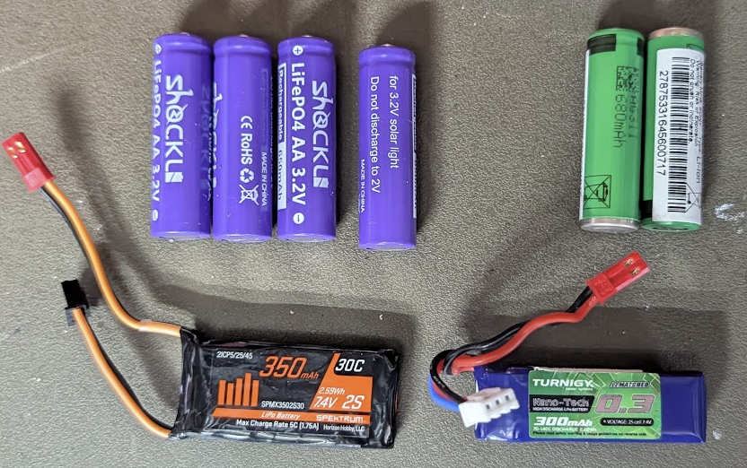

# Batteries #
There are multiple options for batteries in these cars. This is somewhat dependent 
on which electronics are chosen, but most electronics will be tolerant to a wide
range of voltages.

In general, unless you are using a specific 1S ESC (uncommon), your battery setup
needs to achieve at least 6 Volts, and more typically close to 8 Volts.

## Battery Configuration ##
To build a 6V to 8V battery pack voltage range will require at least 
2 cells in series in most cases. Sometimes more.

2-cells in series is referred to or abbreviated as "2S", which doubles the voltage.
If you were to run 4-cells, with 2 parallel groups of 2 in series, this would be
referred to as a "2S2P" configuration, with the same voltage as the 2S configuration.

A single cell by itself would be referred to as a "1S" configuration.

## Basic Chemistry Lesson ##
There are many types of batteries out there in the wild, and we do need to know a
bit about them when making our choices, since the battery performance, charging, 
and safety factors are all considerations.

### Lithium Polymer ###
These are the most common "silver pouch cell" batteries that you find. They are 
typically made of a Lithium-Cadmium mixture and have a very high power density. 
These are the de-facto in the RC hobby. However, they are also the most volatile
and require the most care to avoid dangerous situations. These batteries require
special chargers and can never be overcharged or drop below certain voltages. 
They also degrade a bit with each charge/discharge cycle, leading to eventual 
breakdown and will need to be disposed.

These should be charged in a safe area, even within a fire-proof bag. 
These should be stored at a safe "storage voltage", typically around 50-60% of 
charge capacity, to prevent degredation. Do not store charged or discharged for
long periods (more than 24 hours).

A typical Li-Po cell is advertised as 3.7V, but will charge to 4.2V and discharge
to 3.1V. They need to be stored around 3.6V.

### Lithium Ion ###
These are the most common type of industrial-use Lithium chemistry cells, and will
almost always come in a metal cylindrical format. These are very energy dense, but
you take a penalty in weight for the metal container and protection circuits that
come with the cell. 

These are most commonly found in the 18650 size (18mm x 65.0mm cylinders). You can
also find these in 14500 size, which is mostly compatible with AA carriers.

While these are extremely energy dense, their metal casings and (typically) built-in
protection circuits mean they are quite durable compared to Li-Po pouch cells. You still
have to treat them with respect, but they can take much more of a beating on 
charge, discharge, and general usage.

A typical Li-Ion cell is advertised at 3.7V, will charge to 4.2V, and discharge to
3.0V. They should be stored around 3.6V.

### LiFe PO4 ###
Lithium-Iron-Phosphate is a common type of battery, but typically for lower power
density than its Lithium Cadmium and Lithium Ion bretheren. LiFePO4
has the distinct advantage of being less volatile (less likely to catch fire), and
more resistant to harsh charge and discharge cycles. However, they hold less capacity
per weight than the other Lithium variants.

You can find LiFePO4 cells in both pouch and cylindrical forms.

A typical LiFePO4 cell is advertised as 3.2V, but will charge to 3.6V and discharge to 
2.8V. They should be stored around 3.3V. 

### Sodium Ion ###
These are new (as of 2026) and much less common. They have less power density than
LiFePO4, but have almost zero fire risk. They are mostly used in battery backup 
applications, but you may find them in 18650 sizes.

Na-Ion batteries seem to be advertised as 3.2V, but will charge to about 3.8V
and discharge to about 2.5V. 

### Nickel Metal Hydride ###
NiMH is your run-of-the-mill rechargeable household battery. They are reliable, cheap, 
and safe, but they have the lowest energy density and cell voltage on this list. They
also have the highest variance in cell quality, meaning you can have really good 
or really terrible performance, depending on the battery brandh. 

Instead of being able to run 2S (2 in series) like the lithium batteries, we will 
need to run at least 4S when using NiMH. This is how a stock Kyosho car will come, with
4x AAA-sized NiMH batteries required.

## Specific Recommendations ##

### LiFe PO4 AA-Size ###
This is one of the simplest and cheapest options. 
These used to be found under the Shockli brand on Amazon, but they seem to have 
been discontinued there. You can find similar 600mAh capacities on 
[AliExpress](https://www.aliexpress.us/item/3256812105244901.html)
and other sites. The will be advertised as 3.2V 14500 size LiFePO4 batteries. 
These require a specific type of caddy charger that can be set to the proper voltage.

### Turnigy 2S LiPo ###
HobbyKing, a popular RC retailer, owns the Turnigy brand of batteries. They make
a large number of sizes and configurations for most RC applications. We have found
this [Turnigy 300mAh 2S pack](https://hobbyking.com/en_us/turnigy-nano-tech-300mah-2s-70c-hr-technology.html) 
to be a good choice for these cars, and they are reasonably cheap when they're in stock.

### Chargers ###
Look for a multi-chemistry charger with balancing capability, especially if you are
going to use LiPo or LiIon batteries.

- [Turnigy Accucel C150](https://hobbyking.com/en_us/turnigy-us-plug-accucell-c150-lihv-ac-dc-1-6s-10a-150w-smart-balance-charger.html) ($36)

## Connectors ##
[XT-30](https://www.amazon.com/dp/B0875MBLNH). The XT-30s are overkill for our purposes
but they have the advantage of being a soldered connector, so they can be re-used on
several different projects and easily repaired.

[JST](https://www.hansenhobbies.com/products/connectors/miscconnectors/). These are common
2-pin red connectors. They are nice and small, and plenty durable for our purposes. Their
downside is that they require a small crimping tool to attach the pins to the wire, so 
they are essentially single-project-use if you ever have to cut one away without a lead wire.
