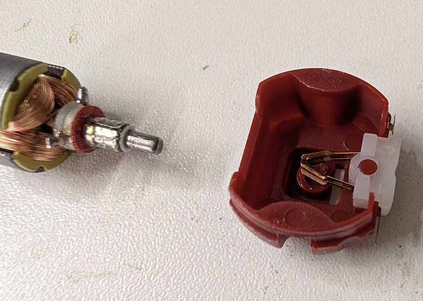
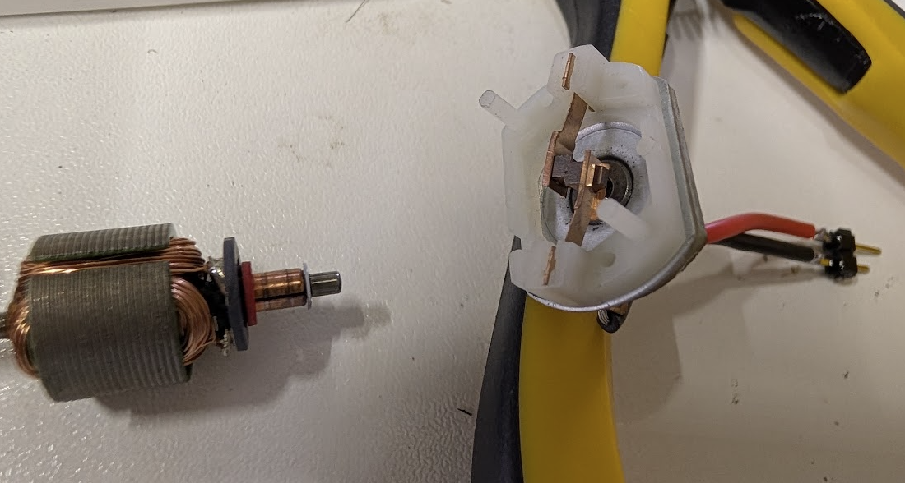
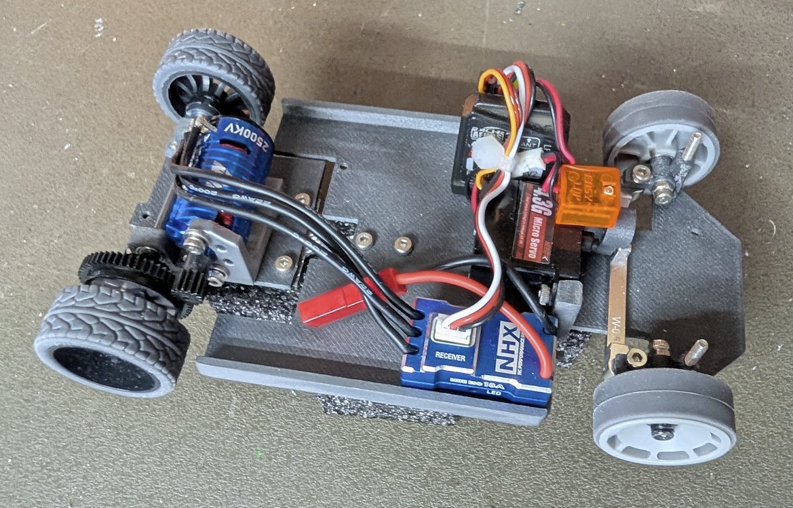

# Electronics #
There are an innumerable number of options for electronics for this project.
This section will be presented in tiers depending on budget and goals.

## Prelude ##
We recommend starting with the budget options, unless you have experience
with 1:28 scale cars and understand what the tradeoffs are. But as an example,
once you start upgrading your powertrain, you will start finding the weak points
with each connected piece of the chassis, and will need to start upgrading more
parts to keep the car running. For instance, once you go beyond a budget motor,
you can no longer 3D print your pinion gears and expect to finish a race event,
and will need to buy brass gears and corresponding equipment to manage them. 

An unmodified budget car is typically not fast by 1:28 standards, but is plenty
to get a beginner started on their journey, and plenty of fun in their own right,
especially on small or constrained tracks.

If you want to be competitive with commercially available starter-cars from the main
brands, you will need to aim for a Mid-tier build.

If you want to be competitive with commercially available high-end cars, you will
need to experiment and spend accordingly. Please share your experiments and findings
as this hasn't been achieved by our team yet.

### Transmitter and Receivers ###
See [Transmitter and Recievers](receivers.md).

### Batteries ###
See [Batteries](batteries.md).

### Motor KV ###
The KV gives some indication of the expected RPM at a given input Voltage. 
We typically don't want a high KV if the car is running at 6V or higher. The
range for these cars is typically 2500kV to 4000kV. You can use higher, but 
the car may have trouble driving slowly. If you run the car at 4V, you can use a
higher KV.

Brushed motors typically don't advertise the KV, so you might need to conversion
between Turns (how many windings of copper wire are around the rotors) to KV. 

### Electronic Speed Controller (ESC) ###
You will need to check the input voltage and type of ESC and make sure it's
compatible with your Battery choice and motor choice. Most ESCs will advertise
their upper and lower voltage limits, as well as their Current limits.

For these cars under normal conditions, we are very unlikely to see more than
a few Amps of current. If you are building a very high powered car, most of
the expensive ESCs are capable of 18-20 Amps without issue.

### Tools and Equipment ###
You will likely need a soldering iron, as many of these budget options will have
connectors that are not necessarily compatible with one another. The 
[PINECIL](https://pine64.com/product/pinecil-smart-mini-portable-soldering-iron/)
is a very popular budget soldering iron that works very well if you have a 
good USB-C charger to power it. ($26)

It is often preferrable to solder the motor to the ESC, but you will need to
have a connector setup between the battery(ies) and the ESC.

For the Servo, Receiver, and ESC to connect together, we typically use the
3-pin 0.1" (2.54mm) connectors, somtimes known as JST-XH connectors. 
If you do need to make one of these connectors, they require a crimping tool. 
You can find [these on amazon](https://www.amazon.com/2020-Piece-Connector-Ratcheting-Crimping-Terminals/dp/B0G2L3LGWD/) 
with a crimp tool and a bunch of connectors that you won't need, but it can get
you started. If you want higher quality components, I recommend using parts
from [Hansen Hobbies](https://www.hansenhobbies.com/products/connectors/servoconnectors/).

## Budget Options ##
In the budget range, you are looking for a Brushed 130 size motor. There are
hundreds of these out there to try, and they will run from about $1 to $8 a 
piece for the inexpensive variants. If you get lucky, you might be able to find 
one with carbon brushes instead of copper. Copper also works fine, but carbon 
brushes should last longer.

Copper Brushes:

Carbon / Graphite Brushes:

With these budget motors, sometimes it's possible to modify them by taking them
apart and reducing the number of windings to increase the KV. This will speed up
the motor, but likely reduce the lifespan.

We have tested these [10-packs of inexpensive 130 motors](https://www.amazon.com/dp/B078MR3H45) 
for many hours and modified several of them. ($14 for 10)

Beware that most of the Tamiya motors are very fast, but also burn through 
brushes very quickly, as they are designed to run around 3V. 

These [6-packs of ESCs](https://www.amazon.com/dp/B0GH65NNN8) are the cheapest budget option
that we have had success with. However, we have certainly burned out a few of these.
The build quality and QA are not great. ($17 for 6)

For the servo, you do not need to spend a lot of money here, especially on a lower
powered car. What you gain in servo upgrades are turning speed and size/weight.
The inexpensive [10-packs of servos](https://www.amazon.com/dp/B08KY49SFX) in the
ubiquitous cheap-servo-blue cases are a great budget option. ($19 for 10)

## Mid-Tier Options ##
There are numerous Brushed Motor and ESC combinations advertised on Ebay and AliExpress.

### Brushed ###
Racing Brushed Motor and ESC.
- [TG Racing 130 Motors on AliExpress](https://www.aliexpress.us/item/3256808970209600.html) ($10 for 1)

### Brushless ###
Budget Brushless Motor and ESC.
- [NHX 2500KV Brushless Motor and ESC Combo on Ebay](https://www.ebay.com/itm/133949755095) ($60)
- [YSIDIO 1410 Brushless Motor and ESC on AliExpress](https://www.aliexpress.us/item/3256805346661858.html) ($37)

### Servos ###
You are looking for inexpensive metal gear servos for speed and durability:
- [MG90s Metal Gear Servo on Amazon](https://www.amazon.com/dp/B0CP98TZJ2) ($14 for 4)
- [TG Digital Servo on AliExpress](https://www.aliexpress.us/item/3256808443190336.html) ($18 for 1)

Or inexpensive sub-micro servos to save space/weight:
- [4.3g Sub-Micro Servo on AliExpress](https://www.aliexpress.us/item/3256808612960463.html) ($5 each)

## High-End Options ##
At the high end, you are looking for a Sensored Brushless Motor and ESC. You can find these from
companies like HobbyWing and PN Racing. These setups will typically run about $150-$200.

You are also looking for a high-torque sub-micro digital servo with metal gears. These are made by
HobbyWing, PN Racing, Torq, and others. These will typically run about $60-$80.

Look for these at established hobby shops, like [A-Main Hobbies](https://www.amainhobbies.com/),
[Kenon Hobby](https://www.kenonhobby.com/), or your local hobby shop.
