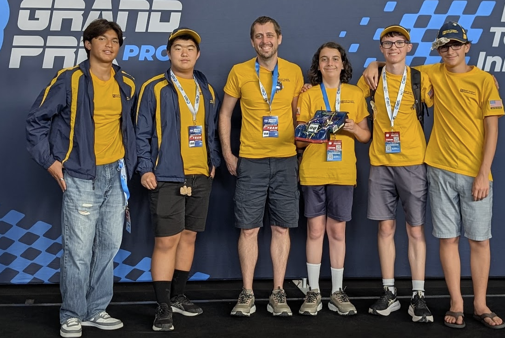
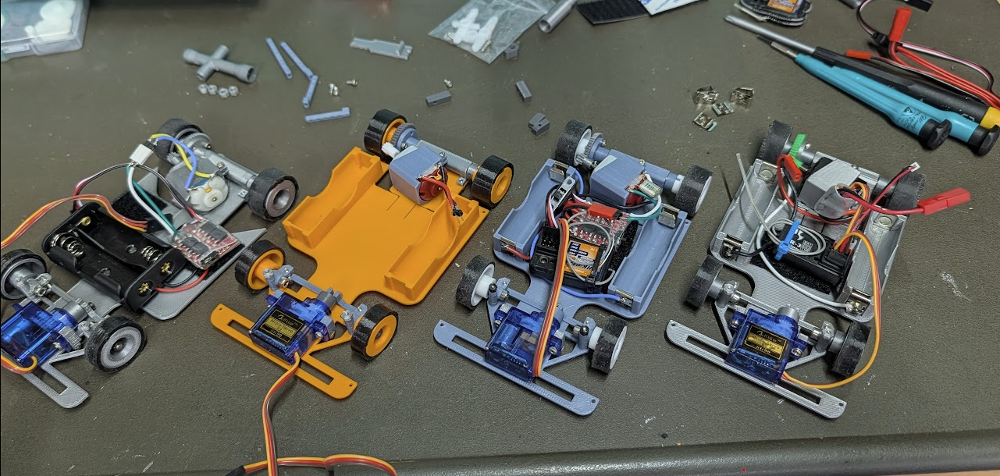
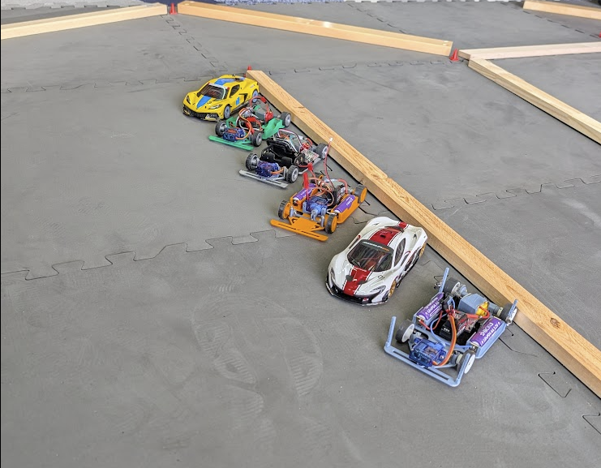
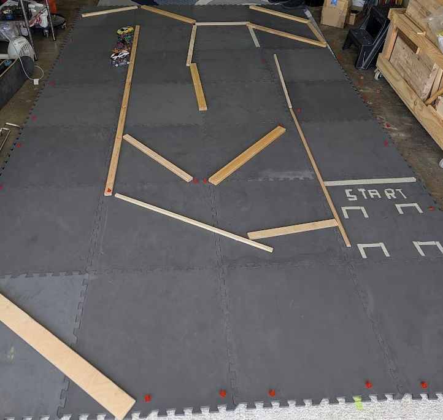

# Project History / Beginnings #
From Coach Kurt

## H2GP Roots ##
I coach a team in the [H2GP](https://www.h2grandprix.com/), where each car costs
thousands of dollars on top of the hundreds of hours of research and labor. 
This program, the cars, the staff, and competition are amazing. It is, however,
a high barrier of entry, and many schools can only afford to run a small handful of
teams. 

The idea to make a very simple, highly modifiable, and cost conscious car came 
from discussions in the stands and pits with other coaches and teachers during 
these events.

## Philosophy ##
My original goal was to get the amortized cost of a car down to about $50. Depending
on your pre-existing knowledge, tools, etc, this project is pretty close to that, but
probably closer to $70 per car until you crest 15+ cars built. 

After letting our H2GP team bash these cars around for many hours of practice, they wanted
to push toward a new goal of making cars that are actually competitive at the 1:28 
scale against commercial alternatives. As such, many of the more recent modifications and 
additions are moving in that direction. Right now, we have cars that are close in 
overall performance to box-stock 1:28 cars that can be built for under $100. 

Once I saw what high schoolers can do with the cars and these files, I'm altering my
goals a bit more. I want this project to provide a competitive and cost-conscious foundation
that allows experimenters to achieve truly competitive cars.

## Development ##
This project is currently entirely done in FreeCAD. This was partly a challenge to 
myself to learn a new tool, but also a decision to move toward something both free 
and more accessible than tools like OpenSCAD that I had previously used to teach CAD.

