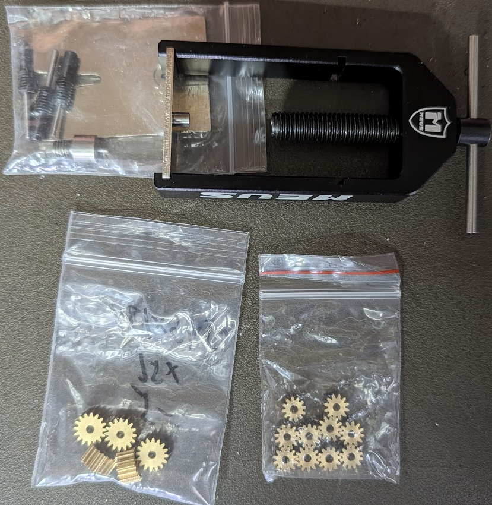

# Materials #
## Prerequisite Tools ##
- 3D Printer
- Small Metric allen wrenches
- Pliers with cutters, or heavy duty cutters, or rotary tool with cut-off wheel (for cutting axles)
- Metal file (for filing axle ends)
- Hobby Knife
- Soldering Iron and related materials
- Super Glue
- Side Cutters (recommended)
- Wire Stripper Pliers (recommended)
- Small Metric Drill bits (recommended)
- Hook and Loop tap (recommended)

## Basic BoM ##
For the printed parts see [Getting Started](gettingstarted.md) and [Printing](printing.md).

### Screws & Nuts ###
- 1x M3x75mm Threaded Rod (rear axle)
 - 2x M3 steel nuts
 - 2x M3 locknuts (printed or metal + nylon)
- 2x M3x16mm (front axles)
 - 2x M3 locknuts (printed or metal + nylon)
- 2x M2x12mm (front steering uprights)
 - 2x M2 locknuts (printed or metal + nylon)
- 2x M2x8mm (front steering links)
- 2x M2x6mm (servo mounting)
- 2x M2x4mm (servo mount to floor pan)
- 1x M2x6mm (motor mount pinch for brushed motors)
 - 1x M2 nut for motor pinch
- 3x M2x4mm (motor mount to floor pan)
 - 3x M2 Nut for motor mount
- 4x M2x4mm (rear axle mount)
- 2x M2x6mm (main gear mount)

Note: There are several car variations, so the actual number of screws used may differ.

Optional Bundles
- [M3 Threaded Rod](https://www.amazon.com/dp/B0CNLN777Z), needs to be at least 70mm ($6 for 10, makes 20 axles)
- [M3 Screw Bundle](https://www.amazon.com/dp/B0BMQFHDBH) (only for front axles, really only need M3x12mm) ($19)
- [M2 Screw Assortment](https://www.amazon.com/dp/B0D3X33XGB) (makes about 5 cars) ($9)
- [M2 Locknuts](https://www.amazon.com/dp/B0DL5S4F9X) (optional) ($8)
- [M3 Locknuts](https://www.amazon.com/dp/B0DFY8Y1TK) (optional) ($6 for 120)

### Bearings ###
The cars are designed to be built with only one type of bearing, the commonly available MR63ZZ, 
at the tradeoff of needing a couple M3 screws per car. However, you can follow what Kyosho does
and use an M2 front axle, if you can find some MR62ZZ bearings.

- 6x [MR63ZZ Bearings](https://www.amazon.com/dp/B0DBQV76LD) ($9 for 20)
- (Optional) 4x [MR62ZZ Bearings](https://www.amazon.com/dp/B0DBQV76LD)

6x MR63ZZ per car.

### Battery Contacts ###
If you are starting with the recommended AA-sized batteries, you will need 
contactors to install and solder into the car.

- 2x Positive Contactor - [Keystone 228](https://www.digikey.com/en/products/detail/keystone-electronics/228/528660) ($0.25)
- 2x Negative Contactor - [Keystone 209](https://www.digikey.com/en/products/detail/keystone-electronics/209/151583) ($0.30)

You will need two positives and two negatives per car.

### Wire ###
You will want to have some small gauge wire on-hand. [26AWG](https://www.amazon.com/dp/B089D3T1JD) 
is plenty for these small cars. ($17)

### Brass Gears (optional) ###
The gears included in these prints use the gear measurement of 0.5 Modulus (0.5M). 

Many upgrade gears for 1:28 scale cars use 64-Pitch (64p, or 64 teeth per inch) gears,
which are close to 0.5M but distinctly different, and will not work. The stronger gear 
will destroy the weaker if these two are combined.

Most of the motors you will encounter require a 2mm tight fit gear, which will 
require a gear pulling/installing tool (Pinion Puller) if you decide to use brass gears.

- [Example Pinion Tool](https://www.amazon.com/dp/B0CQ23ZW3G) ($20)
- [Example Gears](https://www.aliexpress.us/item/3256808560628405.html) ($5)

## Electronics ##
You will need:
- Motor
- ESC

See [Electronics](electronics.md) for more information.

## Batteries ##
You will need a battery setup with 6-8V range. 
You will also need the appropriate charging capabilities. 

See [Batteries](batteries.md) for more information.

## Transmitter and Receiver ##
You will need a 2-channel transmitter and compatible receiver.

See [Transmitters and Receivers](receivers.md) for more information.

## Operation Surfaces ##
These cars will not work well on rough surfaces like concrete and asphalt.
We recommend smooth surfaces, like wooden or linoleum flooring to start.
If you want to build a track, we recommend buying inexpensive foam flooring tiles
from your local home improvement store and arranging them into a track. This is 
essentially what the official 1:28 tracks are made out of, with nicer barriers
and smoother surfaces.

