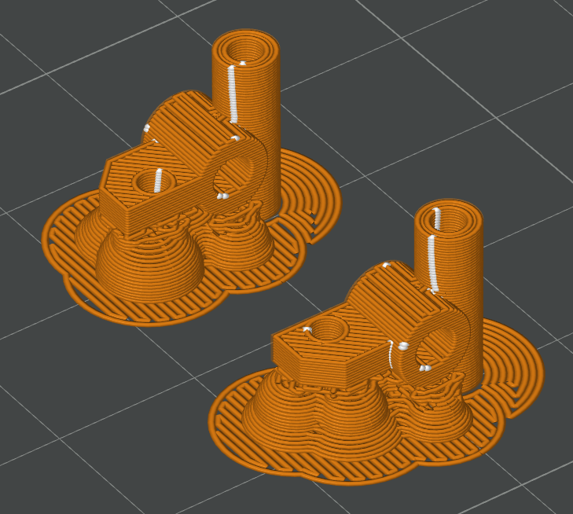
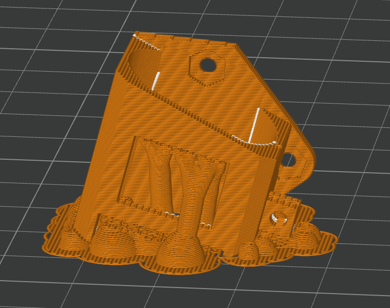
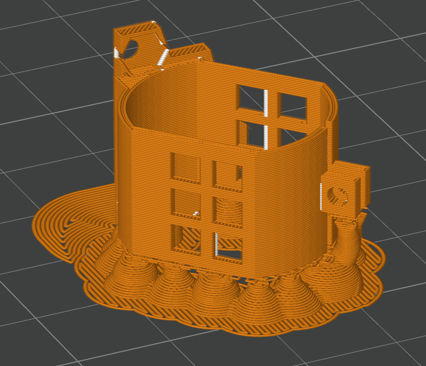

# Printing Tips and Tricks #

## Printer Setup ##
It is recommended to start by printing with PLA, as it is the cheapest and easiest to iterate with.
A PLA car is generally a great starter car, but may start to sag or warp after several hours of use.

All parts can be printed with a 0.4mm nozzle. 
It may be possible to go down to 0.2mm for smaller parts such as gears and the steering uprights to 
get better detail and require less post-processing.

It is recommended to print on a flat or semi-textured bed plate. Higher texture will generally work
but you may run into surface-to-surface issues.

PETG will work, and typically be more durable for parts like the engine mounts that take more heat,
but it is typically softer than PLA, so you may need to adjust settings or add features to stiffen
your parts as you experiment.

PETG-CF has been show to print successful cars, but is not necessarily recommended, as it typically
requires additional considerations and support during printing, and often requires more post-processing.

## Basic Car Parts ##

[WIP]

## Part-Specific Tips ##

### Steering Knuckles / Uprights ###
Print these vertically. You want the least amount of distortion on the vertical tube, since it will have 
to slide on the bolt during operation. Print with ample supports for the steering arm attachment point.

### 130 Motor Flat 15 Degree ###
This is a motor mount that holds the motor at a 15 degree angle to the rear axle and drive gear, but 
allows the motor to sit flat against the rear plate. 

Print this on its side with the main structure parallel but raised up from the bed.

### 130 Motor Tilted ###
This is a motor mount that lifs the at a 45 degree angle to clear the rear axle, much in the way of the
MR-02 2WD Kyosho cars solve this same packaging problem. 

