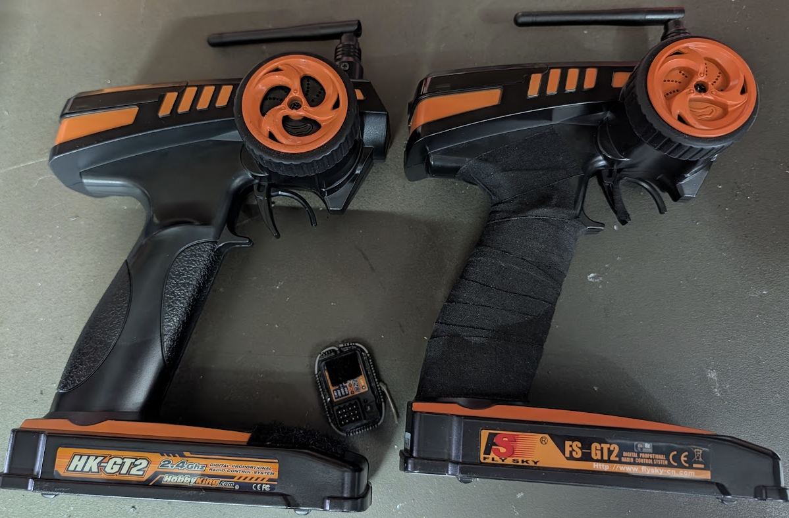

# Transmitters and Receivers #
This is by far the most expensive part of a build. 

## Budget Options ##
Hands down, the [Flysky FS-GT2](https://www.amainhobbies.com/flysky-fsgt2-2channel-transmitter-w-fsgr3e-receiver-fsy-fs-gt2gr3e/p1592821) 
with receiver  is the most durable and recommended transmitter to get started. 
It is not a high precision tool,
but these are incredibly durable and we have some of these that have been abused
by school age children for over a decade and still function. ($30)
The receivers are large, but you can wrap the antennas and stuff them into the car.

These are sometimes sold under different brand names, such as HobbyKing. 

## High End Options ##
The most common controllers you will see at a track are the 
[FlySky Noble NB4+](https://www.amainhobbies.com/flysky-noble-nb4-afhds3-8channel-2.4ghz-radio-system-fsy-noble/p1556281)
and the
[Futaba T4PM+](https://www.amainhobbies.com/futaba-t4pm-4channel-2.4ghz-tfhss-sr-radio-system-w-r304sbe-receiver-fut01004415-1/p1656189).

Both of these transmitters are great. Both offer micro receivers that you can use for smaller cars,
but you can also start with the larger receivers and potentially de-body them (remove the plastic) to make space.

## Rececivers ##
Note that manufacturers are constantly changing the protcols for their transmitters
and receivers. You have to check that the specific transmitter and specific receivers
are compatible protocols, and even protocol versions. AFHDS2 is not compatible with AFHDS3
for instance.

