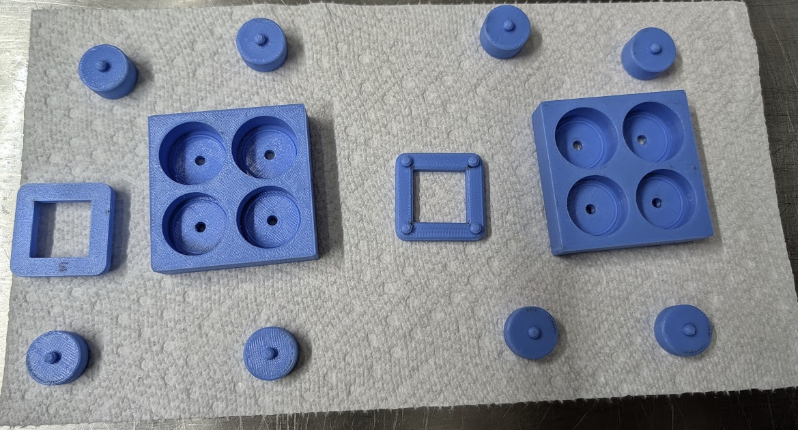
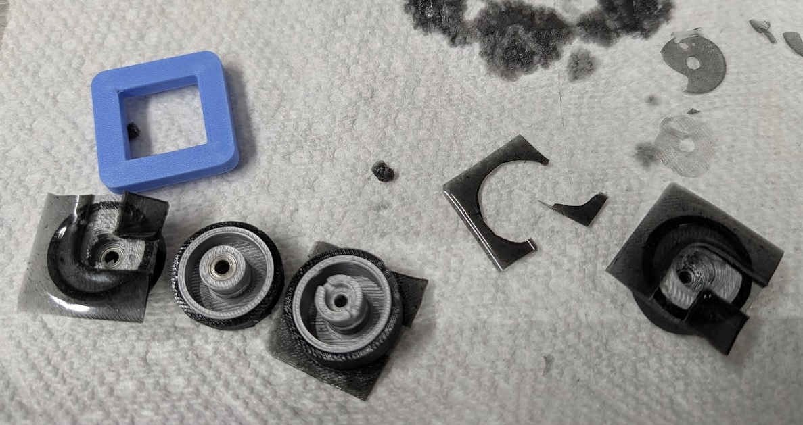

# DIY Tires #
Why would you want to make your own tires? Tires ended up being one of the most
expensive parts on the original Bill of Materials for this projects. This fed 
the desire to explore possible methods for creating our own tires at a lower
cost.

While searching the internet, we came across videos from [@nick_cnc](https://www.youtube.com/@nick_cnc/videos)
that demonstrated a method for creating tires using a urethane casting resin. Nick's
videos were extremely helpful in allowing us to come up with a general recipe that
worked for our cars, but there is a lot of room left to experiment.

## Materials ##
Assuming you already have a 3D printer, you are looking at about $100 in materials to get started. 
At about $7 for a set of front tires, and $8 for a set of rears, you will need to
make more than 7 sets of tires to recoup your costs. 

We have not exhausted our first purchase along these lines, but I expect 50+ sets of
tires can be made from the materials below, which would bring the cost down to about $2
per set.

### Urethane Mix ###
Similar to @nick_cnc's videos, we started with the VytaFlex brand of urethane mixes,
although, so far, we've only used Shore 20 hardness, which is the softest available.
With a [pint unit](https://www.amazon.com/dp/B00IRC0MJW), we have made over 20 sets of
tires, and still have probably 2/3rds of the batch remaining. It's more likely that
the mix goes bad than run out of material in any normal timeframe. ($30)

### Mold Release ###
The [Smooth-On Universal Mold Release](https://www.amazon.com/dp/B004BNHLOK) has worked
well in our testing so far, and there hasn't been any reason to change. ($22) 

### Carbon Black / Lamp Black ###
This is essentially very pure carbon powder. It can be found on the internet in various places
but you need to look for a reliable source that will provide high quality powder. The Inoxia
brand on Amazon seemed to work well, [example item](https://www.amazon.com/dp/B00B0CJDBE). 
100 grams will last a very long time, as you need less than a gram per batch. ($16)

### Printed Tire Molds ###
We printed the tire molds in a harder TPU (Bambu's [TPU For AMS](https://us.store.bambulab.com/products/tpu-for-ams)). 
It has a bit of flex but the real property we're after is the smoothness and layer adhesion for this process.
Other printing materials may work as well, but TPU is the only thing that's been tested so far. ($35)

### Additional Considerations ###
- You will need a scale with .1g resolution. These are readily available on Amazon and other retailers.
- You will need disposable cups (plastic) to pour the urethane. Glass can also work, but they are a lot of work to clean after.
- You will want a tray or pan to use when applying the mold release.
- A heat gun is very useful; a hair dryer may also work.
- A floor heater is useful for pre-warming the urethane mix.
- A heated chamber would probably be ideal, but we haven't used this method.
- A vacuum pump and small chamber is likely ideal, although we haven't used this method.
- A tiny measuring spoon is helpful with the carbon black; the sizes are non-standard, but you want about 2mm x 3mm x 1mm deep, which should be about a quarter of a gram
- You will need mixing sticks, such as food grade popsicle sticks, which should be readily avialable

## Recipe ##
For Two Sets of Tires. Requires two sets of molds.

The amount of carbon black will determine the hardness, but it is a tiny amount. No carbon black, and you
will get tires that are too soft to use. Too much and you will get dry spots in the tires and they will
tear during use.

Heat is helpful to reduce the amount of bubbles that survive the molding process.

Read through all directions here before attempting.

### [Optional] Pre-Warm the Urethane ###
- Set a space heater on Low
- Place both Urethane canisters 1-2ft away from heater
- Let warm for 10 minutes\
OR
- Place both urethane canisters in heating chamber at 90-100F for 10 minutes

### Prepare The Molds ###
- Apply mold release to main face of both molds and upper braces.
 - A light coating, you don't need to overdo it.
- Let stand for 5 minutes. 
- Flip and apply another coat to the back side of molds.
- Let stand for 5 minutes.
- Apply masking tape to the back side of the molds to plug the release holes.

### Timing Note ###
Everything below this point happens rather quickly. You will need to finish this process in
about 10 minutes. Read through this section before starting.

### Mix Urethane ###
- Part A
 - Turn on scale
 - Set empty cup on scale
 - Tare scale
 - Pour 15g of part A into cup while on scale
 - Set Part A to side
- Part B
 - Set second empty cup on scale
 - Tare scale
 - Pour 15g of part B into cup while on scale 
- Carbon Black / Lamp Black
 - Use tiny measuring spoon to extract about 0.25g of carbon black and tap it into one of the mixes
 - Do not touch your measuring spoon to the mix
- Pour Part A (thinner) into Part B (thicker)
 - mix thoroughly for about 3 minutes with a mixing stick

### Mold Pouring ###
Molds should be within a splash safe area, as urethane will stick to almost anything.
Paper towels can be used under the molds.
Caution, molds are very slick to the touch once the mold release is applied, and can be difficult to handle.

- Use heat gun to warm mixture for 1-2 minutes
- With main mold base empty (no plugs, no upper brace), gently pour in each tire location until the holes are about 3/4 full
- Insert center plugs in the appropriate holes, tilt at about 5-10 degrees during initial contact with the 
    urethane to avoid capturing more air
- Overflow of urethane is expected and should occur at this point. If there's not enough overflowing, use some 
    excess from the batch or another location to fill up and over the edge of the tire area
- With plugs insert, but no upper braces, use the heat gun to go around the molds for 1-2 minutes and apply heat
    as directly to urethane area as possible
- Insert upper braces into plugs
- Use the heat gun across the molds for an additional 1-2 minutes to try and remove as much as as possible

At this point, the urethane is probably starting to get noticeably thicker and the heat gun will have less
and less effect.

If you were going to use a vacuum chamber, probably do it after inserting the upper braces and avoid the last direct
heating step. Timing of vacuum application is uncertain.

You can use something heavy and square to set on top of the mold braces to apply pressure (ex: a box of bolts).

### De-Molding ###
Let the urethane cure for 24 hours before de-molding. 

Use a small screwdriver or similar tool to press up from the release holes on the bottom of the molds. Be cautious
not to stab your own hand, as the the molds will sometimes release suddenly. Take your time.

The 4 tires will probably be attached to a square of urethane that had covered the top side of the mold. 

Wash the urethane tire batches in soapy water to remove mold-release from the tires. 

We tend to leave the tires as a set, attached to the molded square piece, until final installation.

### Installation ###
You can attempt to cut the tires away from the molded square ahead of installation, but this has had mixed
results for us.

The easiest way to install the tires is in a permanent fashion. One at a time, set a wheel 1/3 of the way into a tire, 
and then run a tiny bead of super glue around the protruding rim of the wheel. Use caution as to not get any super
glue onto the urethane ahead of time. In a fast motion, press the wheel quickly all the way into the tire and hold
it for a few seconds. The super glue should cure within a few seconds and the tire is permanently attached to the wheel.

After all 4 wheels are installed, use a sharp small pair of scissors to slowly cut away the excess urethane up to the
face of the wheels. 
